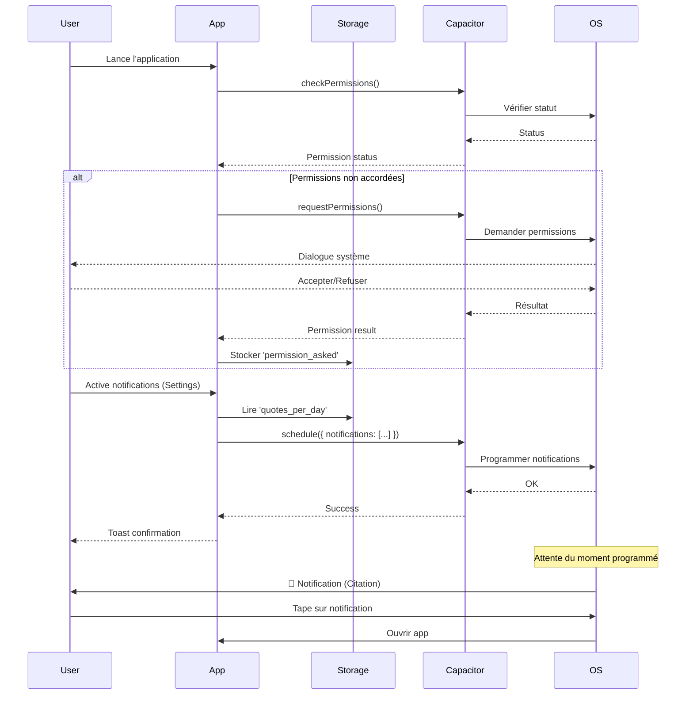

# 📋 CAHIER DES CHARGES - NEXT ME
## Application de Gestion d'Habitudes et de Productivité

---

## 📑 SOMMAIRE

1. [Vue d'ensemble](#vue-densemble)
2. [Architecture Technique](#architecture-technique)
3. [Fonctionnalités Détaillées](#fonctionnalités-détaillées)
4. [Base de Données](#base-de-données)
5. [Système de Notifications](#système-de-notifications)
6. [Design System](#design-system)
7. [Authentification & Sécurité](#authentification--sécurité)
8. [Performance & Optimisation](#performance--optimisation)
9. [Compatibilité Mobile](#compatibilité-mobile)
10. [Roadmap & Évolutions](#roadmap--évolutions)

---

## 🎯 VUE D'ENSEMBLE

### Description Générale
**Next Me** est une application web et mobile de gestion d'habitudes et de productivité qui combine plusieurs outils de développement personnel :
- Suivi d'habitudes quotidiennes avec système de streaks
- Compteurs de progression temporelle
- Timer Pomodoro pour la concentration
- Système de rappels personnalisés
- Citations motivationnelles quotidiennes
- Gamification avec badges et récompenses
- Assistant IA pour suggérer des habitudes personnalisées

### Objectifs Principaux
1. **Simplicité d'utilisation** : Interface intuitive et épurée
2. **Motivation** : Système de récompenses et citations inspirantes
3. **Personnalisation** : Adaptation aux besoins de chaque utilisateur
4. **Accessibilité** : Disponible sur web et mobile (iOS/Android)
5. **Synchronisation** : Données sauvegardées en cloud avec Supabase

### Public Cible
- Personnes cherchant à développer de bonnes habitudes
- Utilisateurs voulant améliorer leur productivité
- Individus souhaitant suivre leur progression personnelle
- Étudiants et professionnels gérant leur temps

---

## 🏗️ ARCHITECTURE TECHNIQUE

### Stack Technologique

#### Frontend
- **Framework** : React 18.3.1
- **Build Tool** : Vite
- **Langage** : TypeScript
- **Styling** : 
  - Tailwind CSS (avec configuration personnalisée)
  - shadcn/ui (composants UI)
  - CSS Variables pour le theming
- **Routing** : React Router DOM v6.30.1
- **State Management** : 
  - React Hooks (useState, useEffect)
  - React Query (@tanstack/react-query)
- **Forms** : React Hook Form + Zod (validation)

#### Backend (Lovable Cloud / Supabase)
- **Base de données** : PostgreSQL (via Supabase)
- **Authentification** : Supabase Auth
- **Storage** : Supabase Storage (si nécessaire)
- **Edge Functions** : Supabase Functions (pour l'assistant IA)
- **Realtime** : Supabase Realtime (optionnel)

#### Mobile
- **Framework** : Capacitor v7.4.4
- **Plateformes** : iOS (7.4.4) & Android (7.4.4)
- **Plugins** :
  - @capacitor/local-notifications (7.0.3) - Notifications locales
  - @capacitor/push-notifications (7.0.3) - Notifications push
  - @capacitor/haptics (7.0.2) - Retours haptiques
  - @capacitor/app (7.1.0) - Cycle de vie de l'app

#### Librairies Principales
- **UI Components** : @radix-ui/* (accordéon, dialog, dropdown, etc.)
- **Icons** : lucide-react (0.462.0)
- **Charts** : recharts (2.15.4)
- **Date Management** : date-fns (3.6.0)
- **Notifications UI** : sonner (1.7.4)
- **Themes** : next-themes (0.3.0)
- **Carousel** : embla-carousel-react (8.6.0)

### Structure des Dossiers

```
src/
├── components/          # Composants réutilisables
│   ├── ui/             # Composants shadcn/ui
│   ├── AddHabitDialog.tsx
│   ├── AddReminderDialog.tsx
│   ├── AddTimerDialog.tsx
│   ├── AgendaWidget.tsx
│   ├── AIAssistantDialog.tsx
│   ├── AppTour.tsx
│   ├── BadgeDisplay.tsx
│   ├── HabitCalendar.tsx
│   ├── HabitCard.tsx
│   ├── HabitIcon.tsx
│   ├── HabitStats.tsx
│   ├── Navigation.tsx
│   ├── PomodoroTimer.tsx
│   ├── ProgressRing.tsx
│   ├── StatsCard.tsx
│   └── TimePickerWheel.tsx
├── pages/              # Pages de l'application
│   ├── Index.tsx       # Page d'accueil/Dashboard
│   ├── Habits.tsx      # Gestion des habitudes
│   ├── Plan.tsx        # Analytiques et badges
│   ├── Timer.tsx       # Compteurs et Pomodoro
│   ├── Settings.tsx    # Paramètres
│   ├── Auth.tsx        # Authentification
│   └── NotFound.tsx    # Page 404
├── hooks/              # Hooks personnalisés
│   ├── useBadges.ts    # Gestion des badges
│   ├── useHabitReset.ts # Réinitialisation quotidienne
│   ├── useNotifications.ts # Notifications natives
│   ├── useReminders.ts # Gestion des rappels
│   ├── use-mobile.tsx  # Détection mobile
│   └── use-toast.ts    # Système de toast
├── lib/                # Utilitaires et configuration
│   ├── i18n.tsx        # Internationalisation
│   ├── theme.ts        # Gestion des thèmes
│   └── utils.ts        # Fonctions utilitaires
├── data/               # Données statiques
│   └── quotes.ts       # Citations motivationnelles
├── utils/              # Fonctions utilitaires
│   └── exportData.ts   # Export CSV/JSON
├── integrations/       # Intégrations externes
│   └── supabase/
│       ├── client.ts   # Client Supabase
│       └── types.ts    # Types TypeScript auto-générés
├── App.tsx             # Composant racine
├── main.tsx            # Point d'entrée
└── index.css           # Styles globaux

supabase/
├── config.toml         # Configuration Supabase
├── functions/          # Edge Functions
│   └── habit-assistant/
│       └── index.ts    # Assistant IA
└── migrations/         # Migrations de la base de données
```

### Environnement & Configuration

#### Variables d'Environnement (.env)
```env
VITE_SUPABASE_URL=https://mlkaaheqivkyneprvuvd.supabase.co
VITE_SUPABASE_PUBLISHABLE_KEY=eyJhbGciOiJIUzI1NiIsInR5cCI6IkpXVCJ9...
VITE_SUPABASE_PROJECT_ID=mlkaaheqivkyneprvuvd
```

#### Configuration Capacitor (capacitor.config.ts)
- App ID : Configuration pour iOS et Android
- Server URL : Pointe vers le build Vite
- Plugins : Configuration des permissions natives

---

## 🎨 FONCTIONNALITÉS DÉTAILLÉES

### 1. PAGE D'ACCUEIL (Index.tsx)

#### 1.1 Dashboard Principal
**Description** : Vue d'ensemble de l'activité quotidienne de l'utilisateur

**Composants** :
- **Statistiques en temps réel** :
  - Habitudes complétées aujourd'hui (avec pourcentage)
  - Meilleur streak actuel
  - Jours consécutifs
  - Badges débloqués (compte total)

- **Citation du jour** :
  - Affichage d'une citation motivationnelle aléatoire
  - Base de données de ~150 citations en français
  - Changement au chargement de la page
  - Design avec effet de gradient et bordure élégante

- **Aperçu des habitudes** :
  - Liste des 3 premières habitudes actives
  - Affichage de l'icône, nom et streak
  - Bouton toggle pour marquer comme complété
  - Indicateur visuel de complétion
  - Lien "Voir tout" vers la page Habitudes

- **Widget Agenda (AgendaWidget)** :
  - Section collapsible/expansible
  - Affichage de la date du jour
  - Liste des tâches/actions planifiées
  - Gestion des objectifs et actions

- **Bouton Assistant IA** :
  - Bouton "Ton assistant personnel" stylisé
  - Icône Sparkles animée
  - Ouvre le dialogue d'assistant IA

**Fonctionnalités Techniques** :
- `useHabitReset()` : Hook pour réinitialiser les habitudes à minuit
- Synchronisation automatique avec localStorage
- Écoute des changements de storage pour mise à jour en temps réel
- Tour guidé de l'application (AppTour) au premier lancement
- Demande de permissions pour les notifications au lancement

**États Locaux** :
```typescript
const [habits, setHabits] = useState<Habit[]>()
const [currentTime, setCurrentTime] = useState(Date.now())
const [showQuote, setShowQuote] = useState(false)
const [agendaOpen, setAgendaOpen] = useState(false)
```

---

### 2. PAGE HABITUDES (Habits.tsx)

#### 2.1 Gestion des Habitudes
**Description** : Interface complète pour créer, modifier et suivre les habitudes

**Fonctionnalités Principales** :

##### 2.1.1 Liste des Habitudes Actives
- **Affichage en grille responsive** :
  - Cards individuelles pour chaque habitude
  - Icône personnalisée (28 icônes disponibles)
  - Nom de l'habitude
  - Compteur de streak (jours consécutifs)
  - État de complétion (today)
  - Bouton de validation

- **Interactions** :
  - Toggle de complétion (avec animation)
  - Mise à jour du streak automatique
  - Sauvegarde du meilleur streak (best_streak)
  - Toasts de confirmation/félicitations

- **Système de Streaks** :
  - Incrémentation automatique lors de la complétion
  - Réinitialisation quotidienne de l'état `completed`
  - Conservation du streak si l'habitude est complétée
  - Mémorisation du meilleur streak personnel

##### 2.1.2 Ajout d'Habitudes
**Dialogue Modal (AddHabitDialog)** :
- **Champs** :
  - Nom de l'habitude (obligatoire, max 50 caractères)
  - Sélection d'icône (grille de 28 icônes)
  - Heure de rappel (optionnel, via TimePickerWheel)

- **Icônes Disponibles** :
  ```typescript
  sport, hydratation, sommeil, meditation, lecture, 
  ecriture, musique, etude, travail, menage, cuisine, 
  jardinage, social, famille, economie, sante, 
  nutrition, hygiene, creativite, apprentissage, 
  bienveillance, gratitude, planification, reveil, 
  detente, marche, yoga, respiration
  ```

- **Validation** :
  - Vérification du nom non vide
  - Génération d'un ID unique (timestamp)
  - Sauvegarde dans localStorage ET Supabase

##### 2.1.3 Statistiques d'Habitudes
**Composant HabitStats** :
- Habitudes totales
- Taux de complétion
- Streak moyen
- Graphiques de progression (recharts)

##### 2.1.4 Section Objectifs
**Gestion des Objectifs à Long Terme** :
- **Création d'objectifs** :
  - Titre de l'objectif
  - Liste d'actions associées
  - Section collapsible par objectif

- **Gestion des actions** :
  - Ajout d'actions spécifiques
  - Suppression d'actions
  - Organisation par objectif parent

- **Stockage** :
  - localStorage : `habitflow_goals`
  - Structure hiérarchique Goal → Actions

##### 2.1.5 Section Badges
**Dialogue de Badges** :
- Affichage de tous les badges débloqués
- Composant `BadgeDisplay` avec icônes colorées
- Badges grisés si non débloqués
- Synchronisation avec Supabase

**Fonctionnalités Techniques** :
```typescript
// Auto-reset à minuit
useHabitReset()

// Calcul des stats pour badges
const stats = {
  totalCompletions: completions.length,
  bestStreak: Math.max(...habits.map(h => h.streak || 0), 0),
  totalHabits: habits.length,
  perfectWeek: false,
}

// Auto-déverrouillage des badges
useBadges(user?.id, stats)
```

**États Locaux** :
```typescript
const [habits, setHabits] = useState<Habit[]>()
const [dialogOpen, setDialogOpen] = useState(false)
const [planOpen, setPlanOpen] = useState(false)
const [badgesDialogOpen, setBadgesDialogOpen] = useState(false)
const [user, setUser] = useState<any>(null)
const [badges, setBadges] = useState<any[]>([])
const [completions, setCompletions] = useState<any[]>([])
const [goals, setGoals] = useState<Goal[]>()
```

---

### 3. PAGE ANALYTIQUES (Plan.tsx)

#### 3.1 Vue d'Ensemble des Performances
**Description** : Analyse détaillée de la progression de l'utilisateur

**Composants Principaux** :

##### 3.1.1 Calendrier d'Habitudes (HabitCalendar)
- **Affichage mensuel** :
  - Grille du mois en cours
  - Jours complétés en vert
  - Jour actuel encadré
  - Légende visuelle

- **Données** :
  - Récupération des completions depuis Supabase
  - Mapping des dates complétées
  - Affichage des streaks visuels

##### 3.1.2 Section Badges
**Affichage Détaillé (BadgeDisplay)** :
- **Grille de badges** :
  - Tous les badges possibles affichés
  - Badges débloqués en couleur
  - Badges verrouillés en grisé
  - Nom et description de chaque badge

- **Types de Badges** :
  ```typescript
  'first_day'       → Premier Pas
  'week_streak'     → Septaine
  'month_streak'    → Mois d'Or
  'hundred_days'    → Centurion
  'ten_habits'      → Décaédrique
  'perfect_week'    → Semaine Parfaite
  ```

- **Conditions de Déverrouillage** :
  - Badge automatique via `useBadges` hook
  - Vérification des conditions en temps réel
  - Insertion dans Supabase si nouveau badge
  - Toast de félicitations

##### 3.1.3 Bouton Assistant IA
**Placement** : Sous la section badges

**Style** :
- Taille large (size="lg")
- Pleine largeur (w-full)
- Gradient de fond (`bg-gradient-to-br from-primary/20 via-primary/10 to-transparent`)
- Bordure épaisse (`border-2 border-primary/50`)
- Effet de glow (`shadow-glow`)
- Animation au survol (`hover:scale-[1.02]`)
- Icône Sparkles de taille 24px

**Fonctionnalité** :
- Ouvre le dialogue `AIAssistantDialog`
- Permet de demander des suggestions d'habitudes à l'IA

##### 3.1.4 Configuration des Citations
**Section collapsible "Configuration du Widget"** :
- **Paramètres** :
  - Nombre de citations par jour (slider 1-5)
  - Activation des notifications
  - Test de notification instantanée
  
- **Actions** :
  - `handleActivateNotifications()` : Programme les citations
  - `handleTestNotification()` : Envoie une citation immédiate
  - Sauvegarde dans localStorage : `quotes_per_day`

##### 3.1.5 Export des Données
**Formats d'Export** :
- **CSV** :
  - Export simple des habitudes
  - Colonnes : name, streak, best_streak, created_at
  - Nom de fichier : `habits_YYYY-MM-DD.csv`

- **JSON** :
  - Export complet de toutes les données
  - Inclut : habits, completions, badges
  - Timestamp d'export inclus
  - Nom de fichier : `nextyou_data_YYYY-MM-DD.json`

**Fonctionnalités Techniques** :
```typescript
// Chargement des données utilisateur
const loadUserData = async () => {
  const { data: { user } } = await supabase.auth.getUser()
  if (user) {
    // Fetch badges
    const { data: badgesData } = await supabase
      .from('badges').select('*').eq('user_id', user.id)
    
    // Fetch habits
    const { data: habitsData } = await supabase
      .from('habits').select('*').eq('user_id', user.id)
    
    // Fetch completions
    const { data: completionsData } = await supabase
      .from('habit_completions').select('*').eq('user_id', user.id)
  }
}

// Auto-unlock badges
useBadges(user?.id, stats)
```

---

### 4. PAGE TIMER (Timer.tsx)

#### 4.1 Gestion des Compteurs
**Description** : Onglet pour suivre le temps écoulé depuis un événement

**Fonctionnalités** :

##### 4.1.1 Liste des Compteurs
- **Affichage** :
  - Cards avec le nom du compteur
  - Durée écoulée en temps réel :
    - Mois, Jours, Heures, Minutes, Secondes
  - Design avec gradient et effet de glow
  - Animation pulse sur les badges

- **Actions** :
  - Bouton de réinitialisation (avec confirmation)
  - Bouton de suppression (avec confirmation)
  - Mise à jour toutes les secondes

- **Cas d'Usage** :
  - Sobriété (alcool, tabac, etc.)
  - Temps depuis un événement important
  - Suivi de périodes spécifiques

##### 4.1.2 Ajout de Compteurs
**Dialogue Modal (AddTimerDialog)** :
- Champ de nom (obligatoire)
- Date de début : maintenant (timestamp)
- Validation et sauvegarde dans localStorage

**Structure de Données** :
```typescript
interface TimerData {
  id: string
  name: string
  startDate: Date
}
```

##### 4.1.3 Timer Pomodoro
**Onglet Séparé** :

**Fonctionnalités** :
- **Sessions de travail** : 25 minutes
- **Sessions de pause** : 5 minutes
- **Contrôles** :
  - Play/Pause
  - Reset
  - Démarrer une pause manuellement

- **Affichage** :
  - Cercle de progression animé (ProgressRing)
  - Temps restant en MM:SS
  - Indicateur de type de session (Travail/Pause)
  - Messages motivationnels

- **Tracking** :
  - Sauvegarde des sessions dans Supabase (`pomodoro_sessions`)
  - Historique des sessions complétées
  - Statistiques de productivité

**Logique du Pomodoro** :
```typescript
const [seconds, setSeconds] = useState(1500) // 25 min
const [isActive, setIsActive] = useState(false)
const [isBreak, setIsBreak] = useState(false)
const [sessionId, setSessionId] = useState<string | null>(null)

// Countdown logic
useEffect(() => {
  let interval: NodeJS.Timeout | null = null
  if (isActive && seconds > 0) {
    interval = setInterval(() => {
      setSeconds(s => s - 1)
    }, 1000)
  } else if (seconds === 0) {
    handleSessionComplete()
  }
  return () => { if (interval) clearInterval(interval) }
}, [isActive, seconds])
```

##### 4.1.4 Section Widget Mobile
**Configuration collapsible** :
- Instructions pour ajouter le widget iOS
- Étapes détaillées d'installation
- Icônes et visuels explicatifs

**Fonctionnalités Techniques** :
```typescript
// Format de durée
const formatDuration = (startDate: Date) => {
  const diff = currentTime - startTime
  const months = Math.floor(diff / (1000 * 60 * 60 * 24 * 30))
  const days = Math.floor((diff % (1000 * 60 * 60 * 24 * 30)) / (1000 * 60 * 60 * 24))
  const hours = Math.floor((diff % (1000 * 60 * 60 * 24)) / (1000 * 60 * 60))
  const minutes = Math.floor((diff % (1000 * 60 * 60)) / (1000 * 60))
  const seconds = Math.floor((diff % (1000 * 60)) / 1000)
  return { months, days, hours, minutes, seconds }
}

// Mise à jour chaque seconde
useEffect(() => {
  const interval = setInterval(() => {
    setCurrentTime(Date.now())
  }, 1000)
  return () => clearInterval(interval)
}, [])
```

---

### 5. PAGE PARAMÈTRES (Settings.tsx)

#### 5.1 Configuration de l'Application
**Description** : Personnalisation et gestion du compte utilisateur

**Sections** :

##### 5.1.1 Profil Utilisateur
**Informations Personnelles** :
- **Affichage** :
  - Email de connexion (lecture seule)
  - Nom complet (éditable)
  - Avatar (optionnel, si implémenté)

- **Modification** :
  - Champ input pour le nom
  - Bouton "Sauvegarder"
  - Mise à jour dans Supabase (`profiles` table)
  - Toast de confirmation

**Code** :
```typescript
const handleUpdateProfile = async () => {
  const { error } = await supabase
    .from("profiles")
    .update({ full_name: fullName })
    .eq("id", user.id)
  
  if (!error) {
    toast({ title: "Profil mis à jour" })
  }
}
```

##### 5.1.2 Thème de l'Application
**Sélection de Thème** :
- **Options** :
  - Clair (light)
  - Sombre (dark)
  - Automatique (system)

- **Implémentation** :
  - Dropdown Select (shadcn)
  - Application immédiate du thème
  - Sauvegarde dans localStorage
  - Utilisation de `next-themes`

**Gestion des Thèmes** :
```typescript
// lib/theme.ts
export type Theme = 'light' | 'dark' | 'system'

export const applyTheme = (theme: Theme) => {
  localStorage.setItem('habitflow_theme', theme)
  const root = document.documentElement
  
  if (theme === 'dark' || 
      (theme === 'system' && window.matchMedia('(prefers-color-scheme: dark)').matches)) {
    root.classList.add('dark')
  } else {
    root.classList.remove('dark')
  }
}
```

##### 5.1.3 Notifications
**Paramètres de Notifications** :
- **Switches** :
  - Notifications quotidiennes (daily)
  - Citations motivationnelles (motivational)
  - Sons (sounds)

- **Stockage** :
  - État local (pas de persistance backend actuellement)
  - Peut être étendu pour sauvegarder les préférences

##### 5.1.4 Langue / Internationalisation
**Sélection de Langue** :
- **Langues Disponibles** :
  - Français (fr)
  - Anglais (en)
  - Espagnol (es)
  - Allemand (de)
  - Italien (it)

- **Implémentation** :
  - Context API (`I18nProvider` dans lib/i18n.tsx)
  - Fichiers de traduction
  - Changement dynamique
  - Sauvegarde dans localStorage

**Traductions** :
```typescript
// lib/i18n.tsx
export type Language = 'fr' | 'en' | 'es' | 'de' | 'it'

const translations: Record<Language, Translations> = {
  fr: {
    welcome: "Bienvenue",
    habits: "Habitudes",
    // ...
  },
  en: {
    welcome: "Welcome",
    habits: "Habits",
    // ...
  },
  // ...
}

export const useTranslation = () => {
  const { language, setLanguage } = useI18n()
  const t = (key: keyof Translations) => translations[language][key]
  return { t, language, setLanguage }
}
```

##### 5.1.5 Export des Données
**Export Complet** :
- Bouton "Exporter toutes mes données"
- Inclut :
  - Habitudes
  - Completions
  - Badges
  - Sessions Pomodoro
  - Rappels
- Format : JSON
- Nom de fichier daté

##### 5.1.6 Connexion / Déconnexion
**Gestion de Session** :
- **Si connecté** :
  - Affichage de l'email
  - Bouton "Se déconnecter"
  - Redirection vers page d'accueil après déconnexion
  
- **Si non connecté** :
  - Bouton "Se connecter"
  - Redirection vers `/auth`

**Code** :
```typescript
const handleSignOut = async () => {
  await supabase.auth.signOut()
  toast({ title: "Déconnexion", description: "À bientôt sur Next Me !" })
  navigate("/")
}
```

##### 5.1.7 Informations de l'Application
**Section À Propos** :
- Version de l'application
- Lien vers la documentation
- Mentions légales (si applicable)
- Contact / Support

**Fonctionnalités Techniques** :
```typescript
const [user, setUser] = useState<any>(null)
const [profile, setProfile] = useState<any>(null)
const [fullName, setFullName] = useState("")
const [currentTheme, setCurrentTheme] = useState<Theme>(getTheme())
const [notifications, setNotifications] = useState({
  daily: true,
  motivational: true,
  sounds: true,
})

// Load user data on mount
useEffect(() => {
  loadUserData()
  applyTheme(currentTheme)
}, [])
```

---

### 6. PAGE AUTHENTIFICATION (Auth.tsx)

#### 6.1 Connexion / Inscription
**Description** : Interface d'authentification avec Supabase Auth

**Fonctionnalités** :

##### 6.1.1 Formulaire d'Inscription (Sign Up)
- **Champs** :
  - Email (validation)
  - Mot de passe (min 6 caractères)
  - Confirmation de mot de passe

- **Validation** :
  - Vérification email valide
  - Correspondance des mots de passe
  - Gestion des erreurs

- **Process** :
  ```typescript
  const { data, error } = await supabase.auth.signUp({
    email,
    password,
    options: {
      data: {
        full_name: fullName, // optionnel
      },
    },
  })
  ```

##### 6.1.2 Formulaire de Connexion (Sign In)
- **Champs** :
  - Email
  - Mot de passe

- **Process** :
  ```typescript
  const { data, error } = await supabase.auth.signInWithPassword({
    email,
    password,
  })
  ```

- **Redirection** :
  - Succès → `/` (dashboard)
  - Échec → Message d'erreur

##### 6.1.3 Récupération de Mot de Passe
- Lien "Mot de passe oublié ?"
- Email de réinitialisation via Supabase
- Redirection vers lien de reset

##### 6.1.4 Configuration Supabase Auth
**Auto-confirmation** :
- Email auto-confirmé activé (pas besoin de vérification email)
- Configuration dans `supabase/config.toml`

**Design** :
- Design moderne avec gradient
- Animation de transition
- Responsive mobile
- Illustration ou logo

---

### 7. ASSISTANT IA (AIAssistantDialog.tsx)

#### 7.1 Suggestions d'Habitudes par IA
**Description** : Chatbot IA pour suggérer des habitudes personnalisées

**Fonctionnalités** :

##### 7.1.1 Interface de Chat
- **Input Message** :
  - Textarea pour décrire ses objectifs
  - Placeholder explicatif
  - Bouton "Obtenir des suggestions"

- **Exemples de Prompts** :
  - "Je veux améliorer ma santé"
  - "J'aimerais être plus productif au travail"
  - "Je veux développer ma créativité"

##### 7.1.2 Edge Function IA
**Endpoint** : `supabase/functions/habit-assistant/index.ts`

**Modèles IA Disponibles (Lovable AI)** :
- `google/gemini-2.5-flash-lite` (rapide, pas cher)
- `google/gemini-2.5-flash` (équilibré)
- `google/gemini-2.5-pro` (le plus puissant)
- `openai/gpt-5-nano` (rapide OpenAI)
- `openai/gpt-5-mini` (équilibré OpenAI)
- `openai/gpt-5` (le plus puissant OpenAI)

**Pas besoin d'API Key** : Lovable AI intégré directement

**Process** :
```typescript
const handleSubmit = async () => {
  setLoading(true)
  
  const { data, error } = await supabase.functions.invoke('habit-assistant', {
    body: { message: userMessage }
  })
  
  if (data) {
    setSuggestions(data.habits)
    setAiMessage(data.message)
  }
  
  setLoading(false)
}
```

##### 7.1.3 Affichage des Suggestions
**Liste d'Habitudes** :
- Chaque suggestion affichée en card
- Icône automatiquement sélectionnée
- Nom de l'habitude
- Bouton "Ajouter" par habitude

**Actions** :
- **Ajouter une habitude** :
  - Ajout individuel à localStorage
  - Toast de confirmation
  
- **Ajouter toutes les habitudes** :
  - Ajout en lot
  - Fermeture automatique du dialogue
  
- **Nouvelle recherche** :
  - Reset des suggestions
  - Retour au formulaire

**Structure de Réponse IA** :
```typescript
interface AIResponse {
  habits: SuggestedHabit[]
  message: string
}

interface SuggestedHabit {
  name: string
  icon: HabitIconType
}
```

##### 7.1.4 Gestion des Erreurs
- Affichage des erreurs réseau
- Message si aucune suggestion
- Retry possible
- Timeout de 30 secondes

**Fonctionnalités Techniques** :
```typescript
const [userMessage, setUserMessage] = useState("")
const [suggestions, setSuggestions] = useState<SuggestedHabit[]>([])
const [aiMessage, setAiMessage] = useState("")
const [loading, setLoading] = useState(false)

// Reset on close
useEffect(() => {
  if (!open) {
    setUserMessage("")
    setSuggestions([])
    setAiMessage("")
  }
}, [open])

// Add habit to localStorage
const handleAddHabit = (habit: SuggestedHabit) => {
  const habits = JSON.parse(localStorage.getItem('habitflow_habits') || '[]')
  const newHabit = {
    id: Date.now().toString(),
    name: habit.name,
    icon: habit.icon,
    streak: 0,
    completed: false,
  }
  habits.push(newHabit)
  localStorage.setItem('habitflow_habits', JSON.stringify(habits))
  toast({ title: "Habitude ajoutée" })
}
```

---

### 8. SYSTÈME DE RAPPELS (useReminders Hook)

#### 8.1 Gestion des Rappels Personnalisés
**Description** : Système complet de gestion de rappels avec notifications

**Fonctionnalités** :

##### 8.1.1 Création de Rappels
**Dialogue Modal (AddReminderDialog)** :
- **Champs** :
  - Titre (obligatoire)
  - Description (optionnel, textarea)
  - Date (date picker)
  - Heure (TimePickerWheel custom)
  - Notification activée (switch)
  - Délai de notification (select) :
    - À l'heure exacte (0 min)
    - 5 minutes avant
    - 15 minutes avant
    - 30 minutes avant
    - 1 heure avant
    - 1 jour avant

- **Validation** :
  - Titre obligatoire
  - Date >= aujourd'hui
  - Heure valide si notification activée

**Structure de Données** :
```typescript
interface Reminder {
  id: string
  title: string
  description?: string
  reminder_date: string // YYYY-MM-DD
  reminder_time?: string // HH:MM
  notification_enabled: boolean
  notification_delay?: number // minutes avant
  completed: boolean
  user_id: string
  created_at: string
  updated_at: string
}
```

##### 8.1.2 Hook useReminders
**Localisation** : `src/hooks/useReminders.ts`

**Fonctions Exportées** :
- `loadReminders()` : Charge les rappels depuis Supabase
- `addReminder(reminder)` : Ajoute un nouveau rappel
- `completeReminder(id)` : Marque comme complété
- `deleteReminder(id)` : Supprime un rappel

**Logique** :
```typescript
export const useReminders = () => {
  const [reminders, setReminders] = useState<Reminder[]>([])
  const [loading, setLoading] = useState(true)
  const [user, setUser] = useState<any>(null)

  useEffect(() => {
    loadUser()
  }, [])

  useEffect(() => {
    if (user) loadReminders()
  }, [user])

  const loadReminders = async () => {
    const { data } = await supabase
      .from('reminders')
      .select('*')
      .eq('user_id', user.id)
      .eq('completed', false)
      .order('reminder_date', { ascending: true })
    setReminders(data || [])
  }

  const addReminder = async (reminder: Omit<Reminder, 'id' | 'user_id' | ...>) => {
    const { data, error } = await supabase
      .from('reminders')
      .insert([{ ...reminder, user_id: user.id }])
      .select()
    
    if (!error) {
      await loadReminders()
      // Schedule notification if enabled
      if (reminder.notification_enabled) {
        scheduleReminderNotification(data[0])
      }
    }
  }

  const completeReminder = async (id: string) => {
    await supabase
      .from('reminders')
      .update({ completed: true })
      .eq('id', id)
    await loadReminders()
  }

  return { reminders, loading, addReminder, completeReminder, deleteReminder }
}
```

##### 8.1.3 Affichage des Rappels
**Widget Agenda (AgendaWidget)** :
- Liste des rappels à venir
- Groupés par date
- Affichage :
  - Titre
  - Description (si présente)
  - Date et heure
  - Badge de notification
  
- **Actions** :
  - Marquer comme complété (checkbox)
  - Supprimer

**Tri et Filtrage** :
- Rappels non complétés uniquement
- Triés par date croissante
- Séparation "Aujourd'hui" / "À venir"

---

## 🗄️ BASE DE DONNÉES

### Architecture Supabase

#### Tables Principales

##### 1. **profiles**
**Description** : Informations des utilisateurs

| Colonne | Type | Contraintes | Description |
|---------|------|-------------|-------------|
| id | uuid | PK, FK → auth.users | ID utilisateur |
| email | text | | Email |
| full_name | text | | Nom complet |
| avatar_url | text | | URL avatar |
| created_at | timestamptz | DEFAULT now() | Date création |
| updated_at | timestamptz | DEFAULT now() | Date mise à jour |

**Relations** :
- 1:N avec `habits`
- 1:N avec `habit_logs`
- 1:N avec `timer_sessions`

**RLS (Row Level Security)** :
```sql
-- Users can only see and update their own profile
CREATE POLICY "Users can view own profile" ON profiles
  FOR SELECT USING (auth.uid() = id);

CREATE POLICY "Users can update own profile" ON profiles
  FOR UPDATE USING (auth.uid() = id);
```

---

##### 2. **habits**
**Description** : Habitudes créées par les utilisateurs

| Colonne | Type | Contraintes | Description |
|---------|------|-------------|-------------|
| id | uuid | PK, DEFAULT gen_random_uuid() | ID habitude |
| user_id | uuid | FK → profiles, NOT NULL | Propriétaire |
| name | text | NOT NULL | Nom habitude |
| icon | text | DEFAULT 'sport' | Type d'icône |
| category | text | | Catégorie |
| description | text | | Description |
| frequency | text | DEFAULT 'daily' | Fréquence |
| target | int | DEFAULT 1 | Objectif |
| streak | int | DEFAULT 0 | Streak actuel |
| best_streak | int | DEFAULT 0 | Meilleur streak |
| reminder_time | text | | Heure de rappel |
| color | text | | Couleur personnalisée |
| is_archived | boolean | DEFAULT false | Archivée ou non |
| created_at | timestamptz | DEFAULT now() | Date création |
| updated_at | timestamptz | DEFAULT now() | Date mise à jour |

**Index** :
```sql
CREATE INDEX idx_habits_user_id ON habits(user_id);
CREATE INDEX idx_habits_active ON habits(user_id, is_archived) 
  WHERE is_archived = false;
```

**RLS** :
```sql
-- Users can only CRUD their own habits
CREATE POLICY "Users can view own habits" ON habits
  FOR SELECT USING (auth.uid() = user_id);

CREATE POLICY "Users can insert own habits" ON habits
  FOR INSERT WITH CHECK (auth.uid() = user_id);

CREATE POLICY "Users can update own habits" ON habits
  FOR UPDATE USING (auth.uid() = user_id);

CREATE POLICY "Users can delete own habits" ON habits
  FOR DELETE USING (auth.uid() = user_id);
```

---

##### 3. **habit_completions**
**Description** : Enregistrements de complétion d'habitudes

| Colonne | Type | Contraintes | Description |
|---------|------|-------------|-------------|
| id | uuid | PK, DEFAULT gen_random_uuid() | ID completion |
| user_id | uuid | NOT NULL | Utilisateur |
| habit_id | uuid | FK → habits | Habitude concernée |
| completed_at | timestamptz | NOT NULL, DEFAULT now() | Date/heure complétion |
| created_at | timestamptz | DEFAULT now() | Date création |

**Index** :
```sql
CREATE INDEX idx_completions_user_id ON habit_completions(user_id);
CREATE INDEX idx_completions_habit_id ON habit_completions(habit_id);
CREATE INDEX idx_completions_date ON habit_completions(completed_at);
```

**Triggers** :
```sql
-- Automatically update streak on completion
CREATE OR REPLACE FUNCTION update_habit_streak()
RETURNS TRIGGER AS $$
BEGIN
  -- Logic to increment streak
  UPDATE habits 
  SET streak = streak + 1,
      best_streak = GREATEST(best_streak, streak + 1)
  WHERE id = NEW.habit_id;
  RETURN NEW;
END;
$$ LANGUAGE plpgsql;

CREATE TRIGGER on_habit_completed
  AFTER INSERT ON habit_completions
  FOR EACH ROW
  EXECUTE FUNCTION update_habit_streak();
```

**RLS** :
```sql
CREATE POLICY "Users can view own completions" ON habit_completions
  FOR SELECT USING (auth.uid() = user_id);

CREATE POLICY "Users can insert own completions" ON habit_completions
  FOR INSERT WITH CHECK (auth.uid() = user_id);
```

---

##### 4. **habit_logs**
**Description** : Logs détaillés avec notes pour chaque complétion

| Colonne | Type | Contraintes | Description |
|---------|------|-------------|-------------|
| id | uuid | PK, DEFAULT gen_random_uuid() | ID log |
| user_id | uuid | FK → profiles, NOT NULL | Utilisateur |
| habit_id | uuid | FK → habits, NOT NULL | Habitude |
| completed_at | timestamptz | DEFAULT now() | Date complétion |
| notes | text | | Notes utilisateur |
| created_at | timestamptz | DEFAULT now() | Date création |

**RLS** :
```sql
CREATE POLICY "Users can CRUD own logs" ON habit_logs
  FOR ALL USING (auth.uid() = user_id);
```

---

##### 5. **badges**
**Description** : Badges débloqués par les utilisateurs

| Colonne | Type | Contraintes | Description |
|---------|------|-------------|-------------|
| id | uuid | PK, DEFAULT gen_random_uuid() | ID badge |
| user_id | uuid | NOT NULL | Utilisateur |
| badge_type | text | NOT NULL | Type de badge |
| badge_name | text | NOT NULL | Nom du badge |
| badge_description | text | | Description |
| unlocked_at | timestamptz | DEFAULT now() | Date déverrouillage |
| created_at | timestamptz | DEFAULT now() | Date création |

**Types de Badges** :
- `first_day` : Premier jour complété
- `week_streak` : 7 jours consécutifs
- `month_streak` : 30 jours consécutifs
- `hundred_days` : 100 jours complétés
- `ten_habits` : 10 habitudes créées
- `perfect_week` : Semaine parfaite (toutes habitudes complétées)

**Index** :
```sql
CREATE UNIQUE INDEX idx_badges_user_type ON badges(user_id, badge_type);
```

**RLS** :
```sql
CREATE POLICY "Users can view own badges" ON badges
  FOR SELECT USING (auth.uid() = user_id);

CREATE POLICY "System can insert badges" ON badges
  FOR INSERT WITH CHECK (auth.uid() = user_id);
```

---

##### 6. **reminders**
**Description** : Rappels personnalisés des utilisateurs

| Colonne | Type | Contraintes | Description |
|---------|------|-------------|-------------|
| id | uuid | PK, DEFAULT gen_random_uuid() | ID rappel |
| user_id | uuid | NOT NULL | Utilisateur |
| title | text | NOT NULL | Titre |
| description | text | | Description |
| reminder_date | date | NOT NULL | Date rappel |
| reminder_time | text | | Heure rappel (HH:MM) |
| notification_enabled | boolean | DEFAULT true | Notif activée |
| notification_delay | int | | Délai notif (minutes) |
| completed | boolean | DEFAULT false | Complété |
| created_at | timestamptz | DEFAULT now() | Date création |
| updated_at | timestamptz | DEFAULT now() | Date mise à jour |

**Index** :
```sql
CREATE INDEX idx_reminders_user_date ON reminders(user_id, reminder_date)
  WHERE completed = false;
```

**RLS** :
```sql
CREATE POLICY "Users can CRUD own reminders" ON reminders
  FOR ALL USING (auth.uid() = user_id);
```

---

##### 7. **timers**
**Description** : Compteurs personnalisés (pas le Pomodoro)

| Colonne | Type | Contraintes | Description |
|---------|------|-------------|-------------|
| id | uuid | PK, DEFAULT gen_random_uuid() | ID timer |
| user_id | uuid | FK → profiles, NOT NULL | Utilisateur |
| name | text | NOT NULL | Nom timer |
| duration | int | DEFAULT 0 | Durée initiale |
| created_at | timestamptz | DEFAULT now() | Date création |
| updated_at | timestamptz | DEFAULT now() | Date mise à jour |

**RLS** :
```sql
CREATE POLICY "Users can CRUD own timers" ON timers
  FOR ALL USING (auth.uid() = user_id);
```

---

##### 8. **timer_sessions**
**Description** : Sessions enregistrées pour les compteurs

| Colonne | Type | Contraintes | Description |
|---------|------|-------------|-------------|
| id | uuid | PK, DEFAULT gen_random_uuid() | ID session |
| user_id | uuid | FK → profiles, NOT NULL | Utilisateur |
| timer_id | uuid | FK → timers, NOT NULL | Timer concerné |
| started_at | timestamptz | DEFAULT now() | Début session |
| completed_at | timestamptz | | Fin session |
| duration | int | NOT NULL | Durée (secondes) |
| created_at | timestamptz | DEFAULT now() | Date création |

**RLS** :
```sql
CREATE POLICY "Users can view own sessions" ON timer_sessions
  FOR SELECT USING (auth.uid() = user_id);
```

---

##### 9. **pomodoro_sessions**
**Description** : Sessions Pomodoro complétées

| Colonne | Type | Contraintes | Description |
|---------|------|-------------|-------------|
| id | uuid | PK, DEFAULT gen_random_uuid() | ID session |
| user_id | uuid | NOT NULL | Utilisateur |
| session_type | text | NOT NULL | 'work' ou 'break' |
| duration_minutes | int | NOT NULL | Durée (minutes) |
| started_at | timestamptz | DEFAULT now() | Début |
| completed_at | timestamptz | | Fin |
| completed | boolean | DEFAULT false | Complétée |
| created_at | timestamptz | DEFAULT now() | Date création |

**RLS** :
```sql
CREATE POLICY "Users can CRUD own pomodoro sessions" ON pomodoro_sessions
  FOR ALL USING (auth.uid() = user_id);
```

---

### Fonctions de Base de Données

#### 1. **update_updated_at_column()**
**Description** : Trigger function pour mettre à jour `updated_at`

```sql
CREATE OR REPLACE FUNCTION update_updated_at_column()
RETURNS TRIGGER AS $$
BEGIN
    NEW.updated_at = now();
    RETURN NEW;
END;
$$ LANGUAGE plpgsql;
```

**Application** :
```sql
CREATE TRIGGER update_habits_updated_at
  BEFORE UPDATE ON habits
  FOR EACH ROW
  EXECUTE FUNCTION update_updated_at_column();

CREATE TRIGGER update_profiles_updated_at
  BEFORE UPDATE ON profiles
  FOR EACH ROW
  EXECUTE FUNCTION update_updated_at_column();
```

---

### Edge Functions

#### habit-assistant
**Localisation** : `supabase/functions/habit-assistant/index.ts`

**Description** : API pour suggérer des habitudes via IA

**Endpoint** : `POST /functions/v1/habit-assistant`

**Body** :
```json
{
  "message": "Je veux améliorer ma santé mentale"
}
```

**Response** :
```json
{
  "habits": [
    { "name": "Méditer 10 minutes", "icon": "meditation" },
    { "name": "Écrire dans un journal", "icon": "ecriture" },
    { "name": "Marcher 30 minutes", "icon": "marche" }
  ],
  "message": "Voici quelques suggestions pour améliorer ta santé mentale :"
}
```

**Implémentation** :
```typescript
import { serve } from "https://deno.land/std@0.168.0/http/server.ts"

serve(async (req) => {
  const { message } = await req.json()
  
  // Call Lovable AI (pas besoin d'API key)
  const response = await fetch('https://api.lovable.ai/chat', {
    method: 'POST',
    headers: { 'Content-Type': 'application/json' },
    body: JSON.stringify({
      model: 'google/gemini-2.5-flash-lite',
      messages: [
        {
          role: 'system',
          content: 'Tu es un coach de développement personnel...'
        },
        {
          role: 'user',
          content: message
        }
      ]
    })
  })
  
  const data = await response.json()
  
  // Parse AI response and format habits
  const habits = parseHabitsFromAI(data)
  
  return new Response(
    JSON.stringify({ habits, message: data.message }),
    { headers: { "Content-Type": "application/json" } }
  )
})
```

---

## 🔔 SYSTÈME DE NOTIFICATIONS

### Architecture des Notifications

#### Types de Notifications
1. **Citations Motivationnelles** : Programmées périodiquement
2. **Rappels d'Habitudes** : Heure personnalisée par habitude
3. **Rappels Personnalisés** : Événements spécifiques
4. **Alertes Pomodoro** : Fin de session de travail/pause

---

### Hook useNotifications

**Localisation** : `src/hooks/useNotifications.ts`

**Fonctions Principales** :

#### 1. scheduleQuoteNotifications()
**Description** : Programme les citations motivationnelles pour les 20 prochains jours

**Logique** :
```typescript
export const scheduleQuoteNotifications = async () => {
  try {
    // Check permissions
    const perm = await LocalNotifications.checkPermissions()
    if (perm.display !== 'granted') {
      const result = await LocalNotifications.requestPermissions()
      if (result.display !== 'granted') throw new Error('Permissions denied')
    }

    // Cancel previous notifications
    await LocalNotifications.cancel({ notifications: [...] })

    // Get settings
    const quotesPerDay = parseInt(localStorage.getItem('quotes_per_day') || '3')
    const totalDays = 20 // Limité pour iOS (max 64 notifications)
    const totalNotifications = Math.min(quotesPerDay * totalDays, 64)

    // Schedule notifications
    const notifications = []
    for (let day = 0; day < totalDays; day++) {
      for (let i = 0; i < quotesPerDay; i++) {
        const date = new Date()
        date.setDate(date.getDate() + day)
        
        // Random time between 9h and 22h
        const hour = 9 + Math.floor(Math.random() * 13)
        const minute = Math.floor(Math.random() * 60)
        date.setHours(hour, minute, 0, 0)

        const quote = quotes[Math.floor(Math.random() * quotes.length)]
        
        notifications.push({
          id: Date.now() + day * 100 + i,
          title: "💡 Citation du jour",
          body: quote.text,
          schedule: { at: date },
          smallIcon: "ic_launcher",
        })
      }
    }

    await LocalNotifications.schedule({ notifications })
  } catch (error) {
    console.error('Error scheduling notifications:', error)
    throw error
  }
}
```

**Contraintes iOS** :
- Maximum 64 notifications programmées à la fois
- Au-delà, les plus anciennes sont remplacées
- C'est pourquoi on limite à 20 jours maximum

---

#### 2. sendInstantQuote()
**Description** : Envoie une citation immédiatement (test)

```typescript
export const sendInstantQuote = async () => {
  const perm = await LocalNotifications.checkPermissions()
  if (perm.display !== 'granted') return

  const quote = quotes[Math.floor(Math.random() * quotes.length)]
  
  await LocalNotifications.schedule({
    notifications: [{
      id: Date.now(),
      title: "💡 Citation inspirante",
      body: quote.text,
      schedule: { at: new Date(Date.now() + 1000) }, // 1 seconde
      smallIcon: "ic_launcher",
    }]
  })
}
```

---

#### 3. scheduleHabitReminder()
**Description** : Programme un rappel pour une habitude spécifique

```typescript
export const scheduleHabitReminder = async (habit: {
  id: string
  name: string
  reminder_time: string // "HH:MM"
}) => {
  if (!habit.reminder_time) return

  const [hours, minutes] = habit.reminder_time.split(':').map(Number)
  const date = new Date()
  date.setHours(hours, minutes, 0, 0)
  
  // If time has passed today, schedule for tomorrow
  if (date < new Date()) {
    date.setDate(date.getDate() + 1)
  }

  await LocalNotifications.schedule({
    notifications: [{
      id: parseInt(habit.id),
      title: `⏰ Rappel : ${habit.name}`,
      body: "C'est l'heure de faire ton habitude !",
      schedule: { 
        at: date,
        repeats: true, // Répète chaque jour
        every: 'day',
      },
      smallIcon: "ic_launcher",
    }]
  })
}
```

---

#### 4. scheduleReminderNotification()
**Description** : Programme une notification pour un rappel personnalisé

```typescript
export const scheduleReminderNotification = async (reminder: {
  id: string
  title: string
  reminder_date: string
  reminder_time?: string
  notification_delay?: number // minutes avant
}) => {
  const date = new Date(reminder.reminder_date)
  
  if (reminder.reminder_time) {
    const [hours, minutes] = reminder.reminder_time.split(':').map(Number)
    date.setHours(hours, minutes, 0, 0)
  }
  
  // Apply delay
  if (reminder.notification_delay) {
    date.setMinutes(date.getMinutes() - reminder.notification_delay)
  }

  // Don't schedule past notifications
  if (date < new Date()) return

  await LocalNotifications.schedule({
    notifications: [{
      id: parseInt(reminder.id),
      title: `📅 Rappel : ${reminder.title}`,
      body: reminder.description || "Tu as un rappel programmé",
      schedule: { at: date },
      smallIcon: "ic_launcher",
    }]
  })
}
```

---

### Configuration iOS

**Fichier** : `capacitor.config.ts`

```typescript
import { CapacitorConfig } from '@capacitor/cli';

const config: CapacitorConfig = {
  appId: 'com.nextyou.app',
  appName: 'Next Me',
  webDir: 'dist',
  server: {
    androidScheme: 'https'
  },
  plugins: {
    LocalNotifications: {
      smallIcon: "ic_launcher",
      iconColor: "#488AFF",
      sound: "beep.wav",
    },
  },
};

export default config;
```

**Permissions iOS** (Info.plist) :
```xml
<key>NSUserNotificationsUsageDescription</key>
<string>Next Me a besoin d'accéder aux notifications pour t'envoyer des rappels d'habitudes et des citations motivationnelles.</string>
```

---

### Configuration Android

**Permissions** (AndroidManifest.xml) :
```xml
<uses-permission android:name="android.permission.POST_NOTIFICATIONS" />
<uses-permission android:name="android.permission.SCHEDULE_EXACT_ALARM" />
```

**Icônes** :
- Placer `ic_launcher.png` dans `android/app/src/main/res/mipmap-*/`
- Format : PNG transparent avec alpha channel

---

### Flux de Notification



---

### Debugging des Notifications

#### Vérifier les Permissions
```typescript
const checkNotificationStatus = async () => {
  const status = await LocalNotifications.checkPermissions()
  console.log('Notification permissions:', status.display)
  // 'prompt' | 'granted' | 'denied'
}
```

#### Lister les Notifications Programmées
```typescript
const listScheduled = async () => {
  const pending = await LocalNotifications.getPending()
  console.log('Pending notifications:', pending.notifications.length)
  console.log(pending.notifications)
}
```

#### Annuler Toutes les Notifications
```typescript
const cancelAll = async () => {
  const pending = await LocalNotifications.getPending()
  const ids = pending.notifications.map(n => n.id)
  await LocalNotifications.cancel({ notifications: ids.map(id => ({ id })) })
}
```

---

## 🎨 DESIGN SYSTEM

### Tokens de Couleurs

**Fichier** : `src/index.css`

```css
@layer base {
  :root {
    /* Background */
    --background: 0 0% 100%;
    --foreground: 240 10% 3.9%;
    
    /* Cards & Popups */
    --card: 0 0% 100%;
    --card-foreground: 240 10% 3.9%;
    
    /* Popover */
    --popover: 0 0% 100%;
    --popover-foreground: 240 10% 3.9%;
    
    /* Primary (Couleur principale) */
    --primary: 240 5.9% 10%;
    --primary-foreground: 0 0% 98%;
    
    /* Secondary */
    --secondary: 240 4.8% 95.9%;
    --secondary-foreground: 240 5.9% 10%;
    
    /* Muted (Éléments secondaires) */
    --muted: 240 4.8% 95.9%;
    --muted-foreground: 240 3.8% 46.1%;
    
    /* Accent (Highlights) */
    --accent: 240 4.8% 95.9%;
    --accent-foreground: 240 5.9% 10%;
    
    /* Destructive (Danger) */
    --destructive: 0 84.2% 60.2%;
    --destructive-foreground: 0 0% 98%;
    
    /* Borders */
    --border: 240 5.9% 90%;
    --input: 240 5.9% 90%;
    --ring: 240 5.9% 10%;
    
    /* Radius */
    --radius: 0.5rem;
    
    /* Custom Gradients */
    --gradient-primary: linear-gradient(135deg, hsl(var(--primary)), hsl(var(--primary-glow)));
    --gradient-subtle: linear-gradient(180deg, hsl(var(--background)), hsl(var(--muted)));
    
    /* Shadows */
    --shadow-glow: 0 0 40px hsl(var(--primary) / 0.2);
    --shadow-elegant: 0 10px 30px -10px hsl(var(--primary) / 0.3);
  }

  .dark {
    --background: 240 10% 3.9%;
    --foreground: 0 0% 98%;
    
    --card: 240 10% 3.9%;
    --card-foreground: 0 0% 98%;
    
    --popover: 240 10% 3.9%;
    --popover-foreground: 0 0% 98%;
    
    --primary: 0 0% 98%;
    --primary-foreground: 240 5.9% 10%;
    
    --secondary: 240 3.7% 15.9%;
    --secondary-foreground: 0 0% 98%;
    
    --muted: 240 3.7% 15.9%;
    --muted-foreground: 240 5% 64.9%;
    
    --accent: 240 3.7% 15.9%;
    --accent-foreground: 0 0% 98%;
    
    --destructive: 0 62.8% 30.6%;
    --destructive-foreground: 0 0% 98%;
    
    --border: 240 3.7% 15.9%;
    --input: 240 3.7% 15.9%;
    --ring: 240 4.9% 83.9%;
  }
}
```

---

### Configuration Tailwind

**Fichier** : `tailwind.config.ts`

```typescript
import type { Config } from "tailwindcss"

const config = {
  darkMode: ["class"],
  content: [
    './pages/**/*.{ts,tsx}',
    './components/**/*.{ts,tsx}',
    './app/**/*.{ts,tsx}',
    './src/**/*.{ts,tsx}',
  ],
  prefix: "",
  theme: {
    container: {
      center: true,
      padding: "2rem",
      screens: {
        "2xl": "1400px",
      },
    },
    extend: {
      colors: {
        border: "hsl(var(--border))",
        input: "hsl(var(--input))",
        ring: "hsl(var(--ring))",
        background: "hsl(var(--background))",
        foreground: "hsl(var(--foreground))",
        primary: {
          DEFAULT: "hsl(var(--primary))",
          foreground: "hsl(var(--primary-foreground))",
        },
        secondary: {
          DEFAULT: "hsl(var(--secondary))",
          foreground: "hsl(var(--secondary-foreground))",
        },
        destructive: {
          DEFAULT: "hsl(var(--destructive))",
          foreground: "hsl(var(--destructive-foreground))",
        },
        muted: {
          DEFAULT: "hsl(var(--muted))",
          foreground: "hsl(var(--muted-foreground))",
        },
        accent: {
          DEFAULT: "hsl(var(--accent))",
          foreground: "hsl(var(--accent-foreground))",
        },
        popover: {
          DEFAULT: "hsl(var(--popover))",
          foreground: "hsl(var(--popover-foreground))",
        },
        card: {
          DEFAULT: "hsl(var(--card))",
          foreground: "hsl(var(--card-foreground))",
        },
      },
      borderRadius: {
        lg: "var(--radius)",
        md: "calc(var(--radius) - 2px)",
        sm: "calc(var(--radius) - 4px)",
      },
      keyframes: {
        "accordion-down": {
          from: { height: "0" },
          to: { height: "var(--radix-accordion-content-height)" },
        },
        "accordion-up": {
          from: { height: "var(--radix-accordion-content-height)" },
          to: { height: "0" },
        },
      },
      animation: {
        "accordion-down": "accordion-down 0.2s ease-out",
        "accordion-up": "accordion-up 0.2s ease-out",
      },
      boxShadow: {
        'glow': '0 0 40px hsl(var(--primary) / 0.2)',
        'elegant': '0 10px 30px -10px hsl(var(--primary) / 0.3)',
      },
    },
  },
  plugins: [require("tailwindcss-animate")],
} satisfies Config

export default config
```

---

### Composants UI (shadcn/ui)

**Localisation** : `src/components/ui/`

**Composants Installés** :
- **Layout** : accordion, card, separator, sidebar, tabs
- **Form** : button, input, textarea, label, checkbox, radio-group, select, slider, switch
- **Feedback** : alert, alert-dialog, toast, sonner, skeleton, progress
- **Overlay** : dialog, drawer, sheet, popover, hover-card, dropdown-menu, context-menu
- **Navigation** : navigation-menu, breadcrumb, pagination, menubar
- **Data Display** : table, badge, avatar, calendar, chart, aspect-ratio
- **Utility** : collapsible, scroll-area, resizable, tooltip, command, form, carousel, toggle, toggle-group, input-otp

**Personnalisation** :
Tous les composants utilisent les tokens de couleur définis dans `index.css` et peuvent être personnalisés via Tailwind classes ou variants.

---

### Styles Globaux

**Fichier** : `src/App.css`

```css
/* Smooth scrolling */
html {
  scroll-behavior: smooth;
}

/* Custom scrollbar */
::-webkit-scrollbar {
  width: 8px;
}

::-webkit-scrollbar-track {
  background: hsl(var(--muted));
}

::-webkit-scrollbar-thumb {
  background: hsl(var(--primary) / 0.3);
  border-radius: 4px;
}

::-webkit-scrollbar-thumb:hover {
  background: hsl(var(--primary) / 0.5);
}

/* Animations */
@keyframes fadeIn {
  from { opacity: 0; transform: translateY(10px); }
  to { opacity: 1; transform: translateY(0); }
}

.animate-fade-in {
  animation: fadeIn 0.3s ease-out;
}

/* Glass effect */
.glass {
  background: hsl(var(--background) / 0.8);
  backdrop-filter: blur(10px);
  border: 1px solid hsl(var(--border) / 0.5);
}
```

---

### Navigation Bar

**Composant** : `src/components/Navigation.tsx`

**Design** :
- Barre fixe en bas de l'écran
- 5 onglets : Accueil, Habitudes, Analytiques, Timer, Paramètres
- Icônes Lucide React
- Indicateur d'onglet actif
- Responsive mobile avec safe-area

**Fix iOS** :
```css
/* src/index.css */
nav {
  bottom: 0 !important;
  padding-bottom: max(1rem, env(safe-area-inset-bottom));
}
```

---

### Icônes d'Habitudes

**Composant** : `src/components/HabitIcon.tsx`

**28 Icônes Disponibles** :
- sport, hydratation, sommeil, meditation, lecture
- ecriture, musique, etude, travail, menage, cuisine
- jardinage, social, famille, economie, sante
- nutrition, hygiene, creativite, apprentissage
- bienveillance, gratitude, planification, reveil
- detente, marche, yoga, respiration

**Mapping** :
```typescript
export const iconComponents: Record<HabitIconType, React.ReactElement> = {
  sport: <Dumbbell className="w-full h-full" />,
  hydratation: <Droplet className="w-full h-full" />,
  sommeil: <Moon className="w-full h-full" />,
  meditation: <Brain className="w-full h-full" />,
  // ... etc
}
```

**Utilisation** :
```tsx
<HabitIcon icon="sport" className="w-8 h-8" />
```

---

## 🔐 AUTHENTIFICATION & SÉCURITÉ

### Système d'Authentification

#### Configuration Supabase Auth

**Auto-confirmation activée** :
```toml
# supabase/config.toml
[auth]
enable_signup = true
enable_confirmations = false # Pas besoin de confirmer l'email
```

**Méthodes supportées** :
- Email + Mot de passe
- Google OAuth (si configuré)
- Magic Link (si configuré)

---

### Protection des Routes

**Implémentation** :
```typescript
// Dans chaque page protégée
const ProtectedPage = () => {
  const [user, setUser] = useState<any>(null)
  const navigate = useNavigate()

  useEffect(() => {
    checkUser()
  }, [])

  const checkUser = async () => {
    const { data: { user } } = await supabase.auth.getUser()
    if (!user) {
      navigate('/auth')
    } else {
      setUser(user)
    }
  }

  if (!user) return <div>Loading...</div>

  return <div>Protected content</div>
}
```

**Alternative** : Créer un Higher-Order Component :
```typescript
// src/lib/withAuth.tsx
export const withAuth = (Component: React.ComponentType) => {
  return (props: any) => {
    const [user, setUser] = useState<any>(null)
    const navigate = useNavigate()

    useEffect(() => {
      supabase.auth.getUser().then(({ data: { user } }) => {
        if (!user) navigate('/auth')
        else setUser(user)
      })
    }, [])

    if (!user) return <div>Loading...</div>
    return <Component {...props} user={user} />
  }
}

// Usage
export default withAuth(Habits)
```

---

### Row Level Security (RLS)

**Tous les tables ont des RLS policies** :

```sql
-- Exemple pour habits
ALTER TABLE habits ENABLE ROW LEVEL SECURITY;

CREATE POLICY "Users can only see their own habits"
ON habits FOR SELECT
USING (auth.uid() = user_id);

CREATE POLICY "Users can only insert their own habits"
ON habits FOR INSERT
WITH CHECK (auth.uid() = user_id);

CREATE POLICY "Users can only update their own habits"
ON habits FOR UPDATE
USING (auth.uid() = user_id);

CREATE POLICY "Users can only delete their own habits"
ON habits FOR DELETE
USING (auth.uid() = user_id);
```

**Vérification** :
- Aucune requête ne peut accéder aux données d'un autre utilisateur
- Même si un utilisateur malveillant modifie le code frontend
- La base de données refuse les requêtes non autorisées

---

### Secrets & Variables d'Environnement

**Fichier** : `.env` (auto-généré, ne PAS modifier)

```env
VITE_SUPABASE_URL=https://mlkaaheqivkyneprvuvd.supabase.co
VITE_SUPABASE_PUBLISHABLE_KEY=eyJhbGci...
VITE_SUPABASE_PROJECT_ID=mlkaaheqivkyneprvuvd
```

**Utilisation** :
```typescript
// src/integrations/supabase/client.ts
import { createClient } from '@supabase/supabase-js'

const supabaseUrl = import.meta.env.VITE_SUPABASE_URL
const supabaseAnonKey = import.meta.env.VITE_SUPABASE_PUBLISHABLE_KEY

export const supabase = createClient(supabaseUrl, supabaseAnonKey)
```

---

### Validation des Données

**Côté Frontend** :
```typescript
// Avec react-hook-form + zod
import { z } from 'zod'
import { useForm } from 'react-hook-form'
import { zodResolver } from '@hookform/resolvers/zod'

const habitSchema = z.object({
  name: z.string().min(1, "Le nom est requis").max(50, "Max 50 caractères"),
  icon: z.string(),
  reminder_time: z.string().regex(/^([01]\d|2[0-3]):([0-5]\d)$/).optional(),
})

const form = useForm({
  resolver: zodResolver(habitSchema),
  defaultValues: { name: '', icon: 'sport' }
})
```

**Côté Backend (Database Constraints)** :
```sql
ALTER TABLE habits
  ADD CONSTRAINT habits_name_not_empty 
  CHECK (length(trim(name)) > 0);

ALTER TABLE habits
  ADD CONSTRAINT habits_name_length
  CHECK (length(name) <= 50);
```

---

### Prévention des Injections SQL

**Supabase gère automatiquement** :
- Toutes les requêtes via le client Supabase sont paramétrées
- Pas de concaténation de chaînes dans les requêtes
- Utilisation de prepared statements

**Exemple SÉCURISÉ** :
```typescript
// ✅ Sécurisé
const { data } = await supabase
  .from('habits')
  .select('*')
  .eq('user_id', userId) // Paramétré automatiquement
```

**Exemple DANGEREUX (ne PAS faire)** :
```typescript
// ❌ DANGEREUX - N'utilisez JAMAIS de requêtes SQL brutes
await supabase.rpc('execute_sql', { 
  query: `SELECT * FROM habits WHERE user_id = '${userId}'`
})
```

---

## ⚡ PERFORMANCE & OPTIMISATION

### Lazy Loading

**Images** :
```typescript

```

**Routes** (React Router) :
```typescript
import { lazy, Suspense } from 'react'

const Habits = lazy(() => import('./pages/Habits'))
const Plan = lazy(() => import('./pages/Plan'))

<Suspense fallback={<div>Loading...</div>}>
  <Route path="/habits" element={<Habits />} />
</Suspense>
```

---

### Memoization

**React.memo pour composants** :
```typescript
export const HabitCard = React.memo(({ habit, onToggle }: Props) => {
  // Component logic
})
```

**useMemo pour calculs lourds** :
```typescript
const completionDates = useMemo(() => {
  return new Set(
    completions.map(c => new Date(c.completed_at).toISOString().split('T')[0])
  )
}, [completions])
```

**useCallback pour fonctions** :
```typescript
const handleToggle = useCallback((id: string) => {
  setHabits(prev => prev.map(h => 
    h.id === id ? { ...h, completed: !h.completed } : h
  ))
}, [])
```

---

### Optimisation localStorage

**Debounce des écritures** :
```typescript
import { debounce } from 'lodash'

const saveHabits = debounce((habits) => {
  localStorage.setItem('habitflow_habits', JSON.stringify(habits))
}, 500)

useEffect(() => {
  saveHabits(habits)
}, [habits])
```

---

### Bundle Size Optimization

**Vite Configuration** (`vite.config.ts`) :
```typescript
import { defineConfig } from 'vite'
import react from '@vitejs/plugin-react'
import path from 'path'

export default defineConfig({
  plugins: [react()],
  resolve: {
    alias: {
      "@": path.resolve(__dirname, "./src"),
    },
  },
  build: {
    rollupOptions: {
      output: {
        manualChunks: {
          'react-vendor': ['react', 'react-dom', 'react-router-dom'],
          'ui-vendor': ['@radix-ui/*'],
          'chart-vendor': ['recharts'],
        },
      },
    },
  },
})
```

---

### Performance Monitoring

**React DevTools Profiler** :
```typescript
import { Profiler } from 'react'

<Profiler id="Habits" onRender={(id, phase, actualDuration) => {
  console.log(`${id} (${phase}) took ${actualDuration}ms`)
}}>
  <Habits />
</Profiler>
```

---

## 📱 COMPATIBILITÉ MOBILE

### Capacitor Configuration

**Fichier** : `capacitor.config.ts`

```typescript
import { CapacitorConfig } from '@capacitor/cli';

const config: CapacitorConfig = {
  appId: 'com.nextyou.app',
  appName: 'Next Me',
  webDir: 'dist',
  server: {
    androidScheme: 'https'
  },
  plugins: {
    LocalNotifications: {
      smallIcon: "ic_launcher",
      iconColor: "#488AFF",
      sound: "beep.wav",
    },
    PushNotifications: {
      presentationOptions: ["badge", "sound", "alert"],
    },
  },
};

export default config;
```

---

### Build & Déploiement Mobile

#### iOS

**Prérequis** :
- macOS avec Xcode installé
- Apple Developer Account

**Commandes** :
```bash
# Build web
npm run build

# Sync avec Capacitor
npx cap sync ios

# Ouvrir dans Xcode
npx cap open ios

# Build depuis Xcode
# Product > Archive > Distribute App
```

**Configuration** :
- Bundle ID : `com.nextyou.app`
- Version : Gérer dans `ios/App/App/Info.plist`
- Icônes : Placer dans `ios/App/App/Assets.xcassets/AppIcon.appiconset/`
- Splash Screen : `ios/App/App/Assets.xcassets/Splash.imageset/`

---

#### Android

**Prérequis** :
- Android Studio installé
- Java JDK 17+

**Commandes** :
```bash
# Build web
npm run build

# Sync avec Capacitor
npx cap sync android

# Ouvrir dans Android Studio
npx cap open android

# Build depuis Android Studio
# Build > Generate Signed Bundle / APK
```

**Configuration** :
- Package : `com.nextyou.app`
- Version : Gérer dans `android/app/build.gradle`
- Icônes : Placer dans `android/app/src/main/res/mipmap-*/`
- Splash Screen : `android/app/src/main/res/drawable/splash.png`

---

### Responsive Design

**Breakpoints Tailwind** :
```typescript
// tailwind.config.ts
screens: {
  'sm': '640px',
  'md': '768px',
  'lg': '1024px',
  'xl': '1280px',
  '2xl': '1400px',
}
```

**Usage** :
```tsx
<div className="grid grid-cols-1 md:grid-cols-2 lg:grid-cols-3 gap-4">
  {/* Cards */}
</div>
```

**Navigation mobile-friendly** :
```tsx
// Navigation.tsx
<nav className="fixed bottom-0 left-0 right-0 bg-background border-t">
  {/* Safe area pour iOS */}
  <div className="pb-[env(safe-area-inset-bottom)]">
    {/* Icons */}
  </div>
</nav>
```

---

### Gestion du Clavier Mobile

**Auto-scroll sur focus** :
```typescript
useEffect(() => {
  const handleFocus = (e: FocusEvent) => {
    if (e.target instanceof HTMLInputElement || 
        e.target instanceof HTMLTextAreaElement) {
      setTimeout(() => {
        e.target.scrollIntoView({ behavior: 'smooth', block: 'center' })
      }, 300)
    }
  }
  
  window.addEventListener('focusin', handleFocus)
  return () => window.removeEventListener('focusin', handleFocus)
}, [])
```

---

### Haptic Feedback

```typescript
import { Haptics, ImpactStyle } from '@capacitor/haptics'

const triggerHaptic = async () => {
  await Haptics.impact({ style: ImpactStyle.Light })
}

// Usage
<Button onClick={() => {
  triggerHaptic()
  handleAction()
}}>
  Action
</Button>
```

---

## 🗺️ ROADMAP & ÉVOLUTIONS

### Fonctionnalités Actuelles ✅
- ✅ Gestion d'habitudes avec streaks
- ✅ Compteurs temporels personnalisés
- ✅ Timer Pomodoro
- ✅ Système de badges
- ✅ Citations motivationnelles
- ✅ Rappels personnalisés
- ✅ Assistant IA pour suggestions
- ✅ Notifications natives (iOS/Android)
- ✅ Authentification Supabase
- ✅ Synchronisation cloud
- ✅ Dark mode
- ✅ Export de données (CSV/JSON)
- ✅ Multi-langue (FR, EN, ES, DE, IT)

---

### Améliorations Prévues 🔄

#### Court Terme (1-2 mois)
- [ ] **Statistiques avancées** :
  - Graphiques de progression hebdomadaire/mensuelle
  - Heatmap de complétion
  - Comparaison des habitudes
  
- [ ] **Catégories d'habitudes** :
  - Organisation par catégorie (Santé, Travail, Social, etc.)
  - Filtres et tri
  
- [ ] **Notifications enrichies** :
  - Notifications personnalisées par habitude
  - Actions rapides dans les notifications (marquer comme fait)
  - Rappels intelligents basés sur l'historique

- [ ] **Profil amélioré** :
  - Avatar personnalisé
  - Bio et objectifs
  - Historique complet

#### Moyen Terme (3-6 mois)
- [ ] **Partage social** :
  - Partager sa progression
  - Défis entre amis
  - Leaderboards
  
- [ ] **Habits templates** :
  - Templates prédéfinis pour débuter
  - Community templates
  
- [ ] **Widgets iOS/Android** :
  - Widget affichant les habitudes du jour
  - Widget Pomodoro
  - Widget citations
  
- [ ] **Mode hors-ligne amélioré** :
  - Synchronisation intelligente
  - Détection de conflits
  - Queue d'actions

- [ ] **Intégration calendrier** :
  - Synchronisation avec Google Calendar
  - Export des habitudes vers calendrier

#### Long Terme (6-12 mois)
- [ ] **Version web complète** :
  - Dashboard desktop
  - Gestion avancée
  
- [ ] **IA avancée** :
  - Analyse de progression
  - Suggestions personnalisées basées sur l'historique
  - Coaching automatique
  
- [ ] **Intégrations tierces** :
  - Apple Health / Google Fit
  - Strava, MyFitnessPal
  - Notion, Todoist
  
- [ ] **Gamification avancée** :
  - Système de niveaux
  - Avatars et personnalisation
  - Récompenses virtuelles
  
- [ ] **Mode équipe/famille** :
  - Comptes multiples
  - Partage d'objectifs familiaux
  - Suivi collectif

---

### Bugs Connus & Corrections 🐛

#### Résolus ✅
- ✅ Navigation bar se détache du bas sur iOS
- ✅ Scroll dans AIAssistantDialog dépasse l'écran mobile
- ✅ Notifications iOS limitées à 64

#### En cours 🔄
- [ ] Performance lente avec >100 habitudes
- [ ] Délai de synchronisation entre appareils
- [ ] Messages d'erreur pas toujours traduits

---

### Optimisations Techniques 🔧

#### À venir
- [ ] Migration vers React Query pour cache
- [ ] Mise en place de Service Workers (PWA)
- [ ] Compression des images
- [ ] Code splitting avancé
- [ ] Tests unitaires & E2E (Vitest, Playwright)
- [ ] CI/CD avec GitHub Actions
- [ ] Monitoring des erreurs (Sentry)
- [ ] Analytics utilisateur (Mixpanel/Amplitude)

---

## 📊 MÉTRIQUES & ANALYTICS

### KPIs à Suivre
- Nombre d'utilisateurs actifs quotidiens (DAU)
- Nombre d'utilisateurs actifs mensuels (MAU)
- Taux de rétention (J1, J7, J30)
- Nombre moyen d'habitudes par utilisateur
- Taux de complétion des habitudes
- Temps moyen passé dans l'app
- Nombre de sessions Pomodoro complétées
- Nombre de badges débloqués
- Taux d'activation des notifications
- Taux de conversion inscription → utilisation

---

## 🤝 CONTRIBUTION & MAINTENANCE

### Guide de Contribution

**Standards de Code** :
- TypeScript strict mode
- ESLint + Prettier
- Convention de nommage :
  - Components : PascalCase
  - Fichiers : kebab-case
  - Variables/Fonctions : camelCase
  - Constantes : UPPER_SNAKE_CASE

**Structure des Commits** :
```
type(scope): description

feat: nouvelle fonctionnalité
fix: correction de bug
docs: documentation
style: formatage
refactor: refactorisation
test: tests
chore: maintenance
```

---

### Maintenance Régulière

**Hebdomadaire** :
- Vérifier les erreurs en production
- Répondre aux tickets utilisateurs
- Mise à jour des dépendances mineures

**Mensuel** :
- Analyse des métriques
- Revue des performances
- Mise à jour des dépendances majeures
- Backup de la base de données

**Trimestriel** :
- Audit de sécurité
- Revue du design system
- Planification des nouvelles features

---

## 📄 LICENCES & CRÉDITS

### Technologies Utilisées
- **React** : MIT License
- **Vite** : MIT License
- **Tailwind CSS** : MIT License
- **Supabase** : Apache 2.0 License
- **shadcn/ui** : MIT License
- **Lucide Icons** : ISC License
- **Capacitor** : MIT License

### Ressources
- Citations : Domaine public / Creative Commons
- Design inspiration : Divers (à créditer si applicable)

---

## 📞 SUPPORT & CONTACT

### Pour les Utilisateurs
- Email : support@nextyou.app (à configurer)
- FAQ : À créer sur le site
- Tutoriels : YouTube (à créer)

### Pour les Développeurs
- Documentation technique : GitHub Wiki
- Issues : GitHub Issues
- Discord : Communauté (à créer)

---

## 🎓 RESSOURCES ÉDUCATIVES

### Tutoriels Recommandés
- React : reactjs.org/tutorial
- TypeScript : typescriptlang.org/docs
- Tailwind : tailwindcss.com/docs
- Supabase : supabase.com/docs
- Capacitor : capacitorjs.com/docs

### Livres Recommandés
- "Atomic Habits" - James Clear
- "The Power of Habit" - Charles Duhigg
- "Deep Work" - Cal Newport

---

## 📝 NOTES FINALES

### Points Forts de l'Application
1. **Simplicité** : Interface claire et intuitive
2. **Gamification** : Streaks et badges motivants
3. **Flexibilité** : Personnalisation poussée
4. **Multi-plateforme** : Web + iOS + Android
5. **Offline-first** : Fonctionne sans connexion
6. **Open-source ready** : Code propre et documenté

### Points d'Attention
1. **Notifications iOS** : Limite de 64 notifications
2. **Synchronisation** : Gérer les conflits offline/online
3. **Performance** : Optimiser avec beaucoup de données
4. **Sécurité** : Toujours valider côté backend
5. **UX** : Tester régulièrement avec de vrais utilisateurs

---

**Version du document** : 1.0  
**Date de dernière mise à jour** : 2025-11-16  
**Auteur** : Lovable AI Assistant  
**Status** : Complet et à jour

---

Ce cahier des charges est un document vivant qui doit être mis à jour régulièrement au fur et à mesure de l'évolution du projet.
